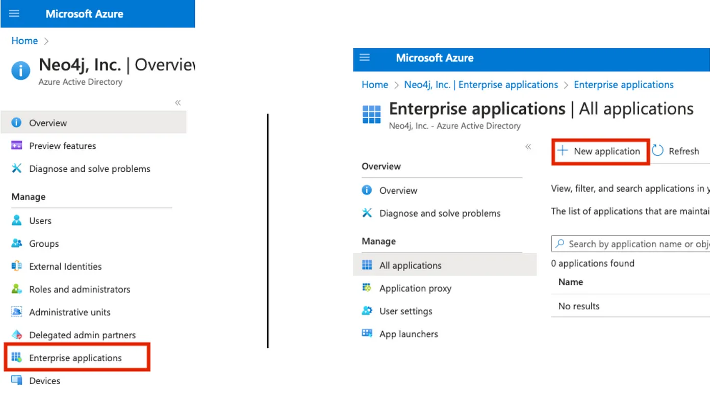

+++
author = "Morgan Senechal"
title = "How to Integrate Neo4j With SSO on Azure — One Login to Rule Them All"
date = "2023-08-17"
description = "Guide on how to configure SSO for Neo4j on Azure"
tags = [
    "neo4j",
    "sso",
    "security",
    "azure",
]
categories = [
    "neo4j",
    "sso",
    "azure",
]
series = ["Guide"]
aliases = ["Neo4j-AAD-SSO"]
image = "assets/Diagram.png"
+++


In your journey to exploring graph databases and getting valuable information, you will want to move your graph into production and share access to your graph with colleagues.

You might need to configure Single Sign-On (SSO) for security reasons and internal policies. This post will guide you through everything you need to know to configure and access your Neo4j graph with SSO authentication and authorization for both user applications (Neo4j Browser, Bloom, Neodash, …) as well as a backend service (which can be your ETL pipeline, GDS batches, etc.).

Introduction
============

**What you’ll learn in this article**
-------------------------------------

Let’s make a small demo based on an SSO integration. The data model is pretty simple. We have 3 Organization nodes, each in a specific region (EMEA, US, and APAC). Each of the organizations has an employee with a property: **name**.


We are going to have 2 users connecting to our application:

*   An end user based in EMEA (will be determined by a group assignment on the Azure Active Directory (AAD)) who can only see data for his region
*   A technical user (or Service Principal) that can read and write anything in our graph from a backend service

That sounds fun, right? Now let’s see how we can make this work:

*   **Section 1:** We will have a high-level introduction to what SSO is and what we get from the integration with Neo4j.
*   **Section 2:** We will setup both AAD and Neo4j to enable SSO authentication for end users.
*   **Section 3:** We will setup both AAD and our backend service to enable SSO for a technical account (Service Principal).
*   **Section 4:** We will put everything together with Neo4j Role Base Access Control (RBAC).

And finally, this is what our simplified SSO flows will look like:


**Prerequisites and Assumptions**
---------------------------------

For this post, we will focus on setting up SSO OpenID Connect (OIDC) for Neo4j Browser and a small Python script as the backend, both using Access Token. We will use Microsoft Azure Active Directory (AAD) as the IdP and use application roles for authorization and data access control.

Although integration with other IdPs (Okta, Google Auth, ...), using different types of tokens, and separating the user apps and backend service in different Apps on the IdD and other architectures are possible, they can’t all be covered in one post.

Before diving into the technical details, ensure you have:

*   Required permissions on your IdP to create applications, users, and groups.
*   A Neo4j Database up and running.

Section 1: Understanding SSO and Neo4j Integration
==================================================

What Is Single Sign-On (SSO)?
-----------------------------

Single Sign-On (SSO) is an authentication mechanism that allows users to access multiple applications or services with a single set of credentials. It eliminates the need for users to remember and enter separate usernames and passwords for each application. SSO enhances user experience, reduces friction, and improves security by centralizing authentication.

End User vs. Technical Account SSO
----------------------------------

**End User**: Enables seamless access for human users by allowing them to log in once and access multiple services without repeated authentication.

**Technical Account/Service Principal**: Facilitates automated, programmatic access for applications and services, enhancing security and enabling controlled resource interaction.

Benefits of SSO integration With Neo4j
--------------------------------------

*   **Unified User Experience**: Users can access Neo4j and other applications with a single set of credentials, streamlining their interactions and reducing login fatigue.
*   **Centralized Identity Management**: Neo4j can delegate authentication to a trusted Identity Provider (IdP), reducing the complexity of managing user accounts.
*   **Enhanced Security**: With SSO, Neo4j can rely on the IdP’s security mechanisms, such as multi-factor authentication, for an added layer of protection.
*   **RBAC Integration**: SSO allows for efficient Role-Based Access Control (RBAC) implementation, leveraging roles assigned by the IdP for Neo4j’s access controls.

Now that we know what SSO and Neo4j are and what benefits we can leverage with the integration, let’s get our hands dirty!

Section 2: Setting Up the SSO for User Apps
===========================================

Azure Active Directory (AAD) Configuration
------------------------------------------

The first thing we need to do is create an Enterprise Application on AAD. To do so, head over to [https://portal.azure.com](https://portal.azure.com) and go to the **AAD** service (from this screen, note your **_Tenant ID_** as we will need it later for the Neo4j configuration). On the left menu, click on **Enterprise Applications** and create a new application.



On the top, select **Create your own application** and give it a name. For this example, I will call it “**Neo4jSSO**” (make sure to select **_Register an application to integrate with Azure AD,_** which will trigger the registration of the application).

Select the supported account type that fits your needs. For this example, I will only allow accounts in my organization. We can then set the redirect URI, which is mandatory for the Neo4j tools (Browser, Bloom, …).


The type for Neo4j Browser is a Single Page Application, and your redirect URI should look like this:

```
http://localhost:7474/browser/?idp_id=azure&auth_flow_step=redirect_uri
```

*   Replace **_http://localhost:7474/browser/_** according to your server. This must be your Neo4j Browser URL.
*   Replace **_azure_** in the second part to reflect the IdP ID you want to give for this setup. This can be anything, but it will need to match the ID you provide in the Neo4j configuration in the next section.

Next, we will configure our application to create a custom scope and therefore restrict access protected by the API. To configure the application, select **_Single Sign-On_** on the left menu, then **_Go to application._**


From there, We can note a couple of things that are going to be required for the Neo4j configuration:

*   Your Application (client) ID in the essentials card. This is usually a set of 5 UIDs separated by a **—**
*   Your OpenID Connect metadata document (aka Well Known Discovery). You can obtain it by clicking on **_Endpoints_** at the top.

> :warning: If you want to enable SSO for other tools than just Neo4j Browser, simply click on **_Authentication_** on the left menu, and add the Redirect URIs for each of your applications.

To create the scope, head over to **_Expose an API_** on the left menu, then click on **_Add a scope_** and keep it to the default value, which should be your application ID.


On the next screen, give your scope a name. For my example, I will name it **Neo4jToken**. Give an accurate description and display name, then add the scope. Now we need to authorize the client application by adding the application as per the screen below:


The last step to enable the API is to give it the required permissions. Select **_API Permissions_** on the left menu, then **_\+ Add a permission_** and search for your App name in the **_APIs my organization uses._** On the next screen, give the permission for the scope we just created, add permissions, and finally **_Grant admin consent_** for the added permission.


Finally, before we move into the Neo4j configuration, make sure to check that the **_accessTokenAcceptedVersion_** property in the manifest is set to 2. This is required because we will be using the v2 endpoints and will be using custom-mapped claims for the backend configuration later.


Neo4j Configuration
-------------------

Now let’s dive into the Neo4j configuration so we can test the SSO Authentication from Neo4j Browser.

```
dbms.security.authentication_providers=oidc-<idp-id>,native  
dbms.security.authorization_providers=oidc-<idp-id>,native  
  
dbms.security.oidc.<idp-id>.display_name=<display-name>  
dbms.security.oidc.<idp-id>.well_known_discovery_uri=<well-known-discovery>  
dbms.security.oidc.<idp-id>.auth_flow=pkce  
dbms.security.oidc.<idp-id>.config=principal=<user-claim>;code_challenge_method=S256  
dbms.security.oidc.<idp-id>.claims.username=<user-claim>  
  
dbms.security.oidc.<idp-id>.audience=<audience>  
dbms.security.oidc.<idp-id>.params=client_id=<client-id>;response_type=code;scope=openid profile email <api>  
  
dbms.security.oidc.<idp-id>.claims.groups=roles
```

*   `<idp-id>`: This **must** be the same as the value you provided earlier in the redirect URI. In my example, this will be **azure**
*   `<display-name>`: This will be the name displayed on the SSO button when opening Neo4j Browser. In this example, I will use **SSO Login**
*   `<well-known-discovery>`: This is the Well Known Discovery we saved earlier. Usually in the form of **https://login.microsoftonline.com/your-tenant-id/v2.0/.well-known/openid-configuration**
*   `<user-claim>`: The claim you want to use for the username. In this example, I will use **preferred_username**
*   `<audience>`: The audience of the token. Usually for the v2, this will be the same as your **Client Application ID**
*   `<client-id>`: The **Client Application ID** we saved earlier
*   `<api>`: This is the API we created earlier. In this example it was **api://client-id/Neo4jToken**

Note that by default Neo4j configuration file already contain a line for the authentication\_providers and authorization\_providers, which can lead to errors when starting Neo4j if you have duplicates of these settings. Make sure to comment or remove them as shown below:

```
#dbms.security.authentication_providers=native  
#dbms.security.authorization_providers=native
```

And voila! You should now be able to start (or restart) your Neo4j database and login with SSO. Make sure to check that your username is correct.

Section 3: Implementing SSO for a Backend Service
=================================================

Azure Active Directory (AAD) Configuration
------------------------------------------

In order to allow our backend to connect to Neo4j using SSO we need to create a technical account (aka Service Principal) that will be used by our script. For this example, we will use a client secret to get a token on behalf of our application.

Head over to the **_Certificates & secrets_** on the left menu, then click on **_New client secret_**. Give the client's secret a description and an expiration.


Don’t forget to copy the **_Value_** (not the **_Secret ID_**) as this only appear once and we will need it for our backend script.


Next, we need to create an application role so that we can later assign it to our ServicePrincipal. To do this, select **_App roles_** on the left menu and click on **_Create app role_**. Enter the display name you want, select **_Both (Users/Groups + Applications)_** as the **allowed member types,** and provide a value. For this example, I will give my technical user the Architect role.


We now need to give the API permission for this new application role. This is done in the same way as we did before by going to **_API Permissions_** then **_Add a permission_** => **_APIs my organization uses_** => **_YourApp_** => **_Application permissions_** and select the new role you created above.

Do not forget to grant admin consent. This should result in something similar to the screen below:


The final couple of steps we need to do on the Azure AD is to assign the role to our ServicePrincipal and create a custom claim. Custom claims are claims we can add to our token for which we can define the value with a custom mapping, transformation, or fixed value.

Before we move out of the application, make sure to go to the manifest and check that the value of **acceptMappedClaims** is **true** (default is **null**) and save if you need to make the change.

To Create the custom claim as well as assign the role to our ServicePrincipal, we need to go back to the EnterpriseApplication view (Home => Azure Active Directory => Enterprise Applications => YourApp).

From the left menu, select **_Users and groups. From_** there, you should see your ServicePrincipal. Select it and **_Edit assignment_**. Click on Select a role from the right menu. You should be able to see and select your application role. You should now have your application role assigned to your ServicePrincipal as below:


Finally, we need to create a custom claim for our ServicePrincipal since this is not a real user. It does not contain a username claim such as preferred\_username, email, etc. To create a custom claim, Select **_Single Sign-On_** from the left menu and click on **_Edit_** in the **_Attributes & Claims_** card.


From there, let’s add a new claim. For this example, I will name it **_myCustomUsername_** and select **_Transformation_** as the Source so we can map an attribute or value depending on a condition. For this demo, I will map the user’s email, and for our ServicePrincipal, I will set a default “Neo4jServicePrincipal” but you can use other types of transformation or custom claims.


Now let’s move into the Neo4j configuration as there are a few changes we need to make so it can accept our Service Principal token.

Neo4j Configuration
-------------------

From the configuration we made in Section 2, we need to change the new username claim (the custom claim we created in the previous step):

```
dbms.security.oidc.<idp-id>.config=principal=<user-claim>;code_challenge_method=S256  
dbms.security.oidc.<idp-id>.claims.username=<user-claim>
```

In the previous step, I created a custom claim named **_myCustomUsername_**. This will be my new value for **_<user-claim>_**. Additionally, you can use the group\_to\_role\_mapping if you want to map your new role to a specific role in your Neo4j Database. (note that this is optional).

Backend Service
---------------

[GitHub - msenechal/SSO-clientCredentials: SSO-clientCredentials](https://github.com/msenechal/SSO-clientCredentials)

For this example, I will be using a Python script (available in the GitHub repository above). In this script, we will acquire a user token from Azure and use that token to authenticate to Neo4j. The repo also contains a Nodejs version, but you can achieve the same with any other language as long as there is a Neo4j driver available and you can acquire a token from client credentials.

The script is pretty simple:

```python
import sys  
import json  
import base64  
import msal  
from neo4j import GraphDatabase, bearer_auth  
  
config = json.load(open(sys.argv[1]))  
  
app = msal.ConfidentialClientApplication(  
    config["client_id"], authority=config["authority"],  
    client_credential=config["secret"],  
    )  
  
result = app.acquire_token_for_client(scopes=config["scope"])  
  
if "access_token" in result:  
    with GraphDatabase.driver(config["NEO4J_URI"], auth=bearer_auth(result['access_token'])) as driver:  
        driver.verify_connectivity()  
        records, summary, keys = driver.execute_query(  
        "MERGE (p:Person {name:'ServicePrincipal', type:'servicePrincipalSSO', app:'python'}) RETURN p",   
        database_="neo4j",  
        )  
else:  
    print(result.get("error"))  
    print(result.get("error_description"))  
    print(result.get("correlation_id")) 
```

First, we are reading the AAD config from a json file passed as a parameter when you run the Python script:

```python
config = json.load(open(sys.argv[1]))
```

Then we use the MSAL library to get a token from client credentials:

```python
app = msal.ConfidentialClientApplication(  
    config["client_id"], authority=config["authority"],  
    client_credentia=config["secret"],  
    )  
  
result = app.acquire_token_for_client(scopes=config["scope"])
```

And finally, this last part is connecting to Neo4j using the Access Token and creating a node Person (We won’t be using it, but this is so we can test both the authentication and authorization) in the graph with a few properties:

```python
with GraphDatabase.driver(config["NEO4J_URI"], auth=bearer_auth(result['access_token'])) as driver:  
        driver.verify_connectivity()  
        records, summary, keys = driver.execute_query(  
        "MERGE (p:Person {name:'ServicePrincipal', type:'servicePrincipalSSO', app:'python'}) RETURN p",   
        database_="neo4j",  
        )
```

If all goes well, you can execute by running:

```shell
python python/main.py params.json
```

And you should now see this new node in your Neo4j graph, created by the Python script using client credentials SSO, as well as this entry in the security.log from Neo4j:

> INFO [Neo4jServicePrincipal]: logged in

Now, although all of this is awesome, let’s take a step further and play with the roles we get from Azure AD to restrict access and permissions on the graph!

Section 4: Putting It All Together With RBAC
============================================

[Role Based Access Control in Neo4j 4.1](https://medium.com/neo4j/role-based-access-control-in-neo4j-4-1-3e65d5b3f45?)

Neo4j RBAC, or Role-Based Access Control, is a security mechanism implemented to control and manage user access to specific data and operations within the database.

Azure Active Directory (AAD) Configuration
------------------------------------------

For this to work, we will need to assign a role to our end user so we can restrict his access based on his role. For this example, I will assign myself the role “EMEA” and keep the role architect for the Service Principal. This way, with the same query, I will only be able to see Tom, where the backend should see all employees.

To assign the “EMEA” role, we simply need to re-do the exact same steps we did in **_Section 3_** when we created the role “architect” and assigned it to the Service Principal. In short: Head to the AAD application, create an app role, give the right permission on the API and assign the new role to your user on the Enterprise Application screen.

Neo4j Graph
-----------

First, we need to create the role EMEA so we can assign the right permissions. The Cypher script below :

1.  (optional) Clean the DB.
2.  Create the role.
3.  Give access to the Neo4j DB, give permission to MATCH any node with the label EMEA and give permission to traverse the relationship HAS\_EMPLOYEE to the role EMEA.
4.  Create the graph.

```sql
// 1. Make sure the DB is empty  
// Uncommenting the line below will delete everything in your database  
// MATCH (n) DETACH DELETE n;  
  
// 2. Create the EMEA Role  
CREATE ROLE EMEA;  
  
// 3. Grant access to the DB as well as match on the EMEA nodes + relationship  
GRANT ACCESS ON DATABASE `neo4j` TO EMEA;  
GRANT MATCH {*} ON GRAPH `neo4j` NODE EMEA TO EMEA;  
GRANT TRAVERSE ON GRAPH neo4j RELATIONSHIPS HAS_EMPLOYEE TO EMEA;  
  
// 4. Create the graph  
CREATE (:Organization:EMEA)-[:HAS_EMPLOYEE]->(:Person:EMEA {name: "Tom"}),  
(:Organization:US)-[:HAS_EMPLOYEE]->(:Person:US {name: "Sabrina"}),  
(:Organization:APAC)-[:HAS_EMPLOYEE]->(:Person:APAC {name: "Lee"});
```

For this example, we will be using this simple match query, returning the name of the employees.

```sql
MATCH (o:Organization)-[:HAS_EMPLOYEE]->(p:Person) RETURN p.name
```

Trying It Out!
==============

Backend
-------

In this example, our Service Principal has the architect role, meaning he should be able to access and read data from the entire graph. Using the same Python script as we used in Section 3, we can simply update the Cypher query and print the result to stdout:

```python
records, summary, keys = driver.execute_query(  
        "MATCH (o:Organization)-[]->(p:Person) RETURN p.name",   
        database_="neo4j",  
        )  
        print(records)
```

Result:

> `<Record p.name=’Tom’>, <Record p.name=’Sabrina’>, <Record p.name=’Lee’>`

🎉 We can see all 3 employees as expected.

User App (Neo4j Browser)
------------------------

Using the previously created SSO integration, I can connect to Neo4j Browser with my user and get the role “EMEA” we assigned on Azure earlier. With the same Cypher query, we should now only see Tom:


Tada 🎉

What Next?
==========

Although this was a fun demo to make and demonstrate all the potential of an SSO integration with Neo4j, we can still take a step further and extend it by adding Bloom or [Neodash](https://neo4j.com/labs/neodash/) with SSO to have a user-friendly visualization dashboard accessible through the seamless authentication process.

In this demo, we had 2users: 1 user with the EMEA role and one technical account who can access everything. As a next step and a good way to test what you learned in this post, I suggest you try to add 2 users to your IdP, one with the role US and another with the role APAC and make sure all 3 users (EMEA, US, and APAC) can only see their region’s data 🤓

For enterprises looking to elevate their security, we can also enable multi-factor authentication and much more. The possibilities are endless!

Wrapping Up
===========

This was only a short post explaining and showing the strength of an SSO OIDC integration with Neo4j and RBAC. The implementation can differ depending on different factors such as your architecture, environment, customization, SSO protocol (OIDC, SAML, …) and so on.

If you encounter issues while setting up SSO with Neo4j, Neo4j user apps (Browser, Bloom, Workspace, Aura,…), NeoDash, and others, here are a few key things you can look at:

*   Read the official Neo4j/Neodash documentation linked below on how to configure SSO.
*   Read your IdP (AAD, Okta, …) documentation on setting up SSO.
*   Reach out on our [Neo4j Discord](https://neo4j.com/developer/discord/) or our [community forum](https://community.neo4j.com/).
*   For customers, you can also create a support ticket on our [support](http://support.neo4j.com/).
*   Additionally, if you need one of our experts you can consult our website [Neo4j Professional Services](https://neo4j.com/professional-services/) or reach out directly at [ps\_emea\_pmo@neotechnology.com](mailto:ps_emea_pmo@neotechnology.com).

Additional Resources
====================
