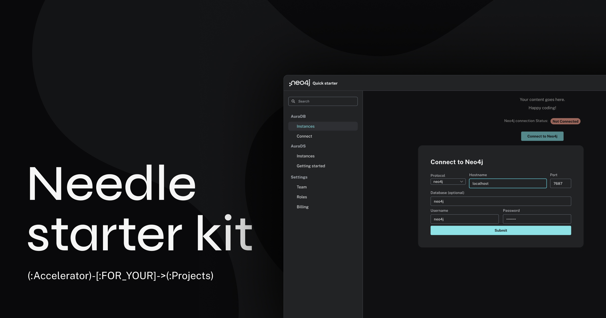
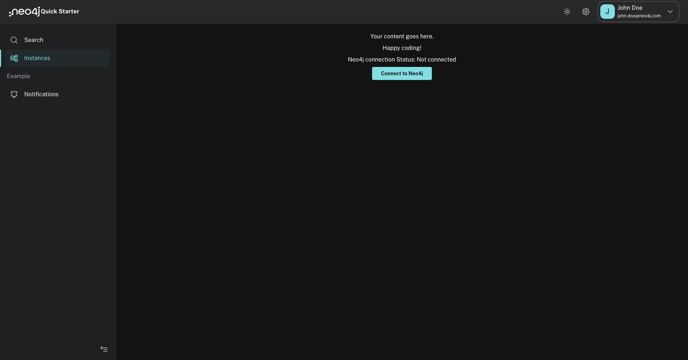

+++
author = "Morgan Senechal"
title = "Needle StarterKit: The Ultimate Tool for Accelerating Your Graph App Projects"
date = "2023-11-08"
description = "Article on how to use a Reactjs StarterKit I built for Neo4j"
tags = [
    "reactjs",
    "neo4j",
]
categories = [
    "reactjs",
    "neo4j",
]
series = ["Neo4j-Needle-StarterKit"]
aliases = ["Neo4j-Needle-StarterKit"]
image = "assets/FeaturedImg.jpg"
+++
Needle StarterKit: The Ultimate Tool for Accelerating Your Graph App Projects
=============================================================================


Now that you have data in your Neo4j database, you want to take it to the next level and create an application for your users — but don’t know where to start? Look no further. This starter kit is made for you!



What is Neo4j Needle StarterKit?
================================

The [Neo4j Needle StarterKit](https://github.com/msenechal/neo4j-needle-starterkit) is a template for developing applications aiming to reduce your development time and accelerate your Time To Value (TTV) ⏰. It leverages the [Neo4j Needle design system](https://medium.com/neo4j/needle-v2-is-here-rebranding-in-the-fast-lane-30cd7dae3efb), providing a responsive and user-friendly interface for applications that interact with Neo4j databases.



[https://github.com/msenechal/neo4j-needle-starterkit/](https://github.com/msenechal/neo4j-needle-starterkit/tree/main)

Key Features
============

1.  🚀 Responsive: Adapts to different screen sizes for optimal user experience.
2.  🌚 Dark/Light Mode Theme 🌞: Includes a theme wrapper to switch between light and dark modes without having to reinvent the wheel!
3.  ⚙️ Neo4j Integration: A simple example for connecting to a Neo4j database.
4.  🔐 Neo4j Auto-connect: Automatically connects to the Neo4j database if the user has a session saved (using localStorage).
5.  💻 Side Navigation: Offers a navigational sidebar for easy access to different parts of the application.
6.  🛠️️ Modular approach: Facilitates easy customization.

Component Architecture
======================

The StarterKit’s architecture is modular, with each component serving a specific purpose. The main components are:

*   App: The root component that wraps everything within the `ThemeWrapper`.
*   QuickStarter: Serves as the primary layout component, including the `Header` and `PageLayout`.
*   Header: Contains the app bar with theme toggle and user information.
*   PageLayout: Organizes the `SideNav` and the main `Content`.
*   Content: The central area where the application’s main content is displayed.
*   ConnectionModal: A modal dialog for connecting to a Neo4j database.
*   Driver: Small utility class to connect to/disconnect from a Neo4j database.

How to Use the StarterKit
=========================

Installation
============

To get started, ensure you have a Neo4j DB up and running. The easiest way to get this done is by starting a free Neo4j instance on Neo4j Aura, Sandbox, or Desktop (_see the additional resources section at the end of this article_).

Then, all you need to do is clone the repository and install the dependencies:

```shell
npm i  
npm run dev
```

Code Snippets
=============

Here are some key components of the Starter kit:

### App Component ([App.tsx](https://github.com/msenechal/neo4j-needle-starterkit/blob/main/src/App.tsx))

```ts
function App() {  
  return (  
    <ThemeWrapper>  
      <QuickStarter />  
    </ThemeWrapper>  
  );  
}
```

The main App is pretty simple. We have our ThemeWrapper (which enables us to have the light/dark mode theme applied to every component of our app without having to apply it everywhere) and the QuickStarter component, which is our main app (composed of the Header and Layout components)

### Light/Dark mode ([Header.tsx](https://github.com/msenechal/neo4j-needle-starterkit/blob/main/src/components/Layout/Header.tsx#L44))

```ts
<IconButton clean size="large" onClick={themeUtils.toggleColorMode}>  
  {theme.palette.mode === "dark" ? (  
    <span role="img" aria-label="sun">  
      <SunIconOutline />  
    </span>  
  ) : (  
    <span role="img" aria-label="moon">  
      <MoonIconOutline />  
    </span>  
  )}  
</IconButton>;
```

The selection of light/dark mode is done in the Header component through the toggle click that triggers the setMode in the ThemeWrapper, which then applies/injects the required classes based on the selected mode. You can then access the current mode in any child by using: `theme.palette.mode`

### Driver ([Driver.tsx](https://github.com/msenechal/neo4j-needle-starterkit/blob/main/src/utils/Driver.tsx))

```ts
export async function setDriver (connectionURI, username, password){  
    try{  
      driver = neo4j.driver(connectionURI,  neo4j.auth.basic(username, password))  
      const serverInfo = await driver.getServerInfo()  
      localStorage.setItem("neo4j.connection", JSON.stringify({"uri":connectionURI, "user":username, "password":password}))  
      return true  
    } catch (err){  
      console.log(`Connection error\n${err}\nCause: ${err.cause}`)
      return false  
    }  
  }  
  
export async function disconnect (){  
    try{  
        driver.close();  
        return true;  
    } catch (err){  
    console.log(`Disconnection error\n${err}\nCause: ${err.cause}`)
      return false  
    }  
}
```

The Driver util is composed of 2 functions:

**_setDriver:_** Takes a Neo4j URI, username, and password to create a driver connection to Neo4j. If successful, save the connection details to the localStorage (for future auto-login) and return `true`. If the connection fails, return `false` and log an error with the details.

**_disconnect:_** Close the current driver or return an error.

### Auto-login ([Content.tsx](https://github.com/msenechal/neo4j-needle-starterkit/blob/main/src/components/Content.tsx#L12))

```ts
useEffect(() => {  
  if (!init) {  
    let session = localStorage.getItem("neo4j.connection");  
    if (session) {  
      let neo4jConnection = JSON.parse(session);  
      setDriver(  
        neo4jConnection.uri,  
        neo4jConnection.user,  
        neo4jConnection.password  
      ).then((isSuccessful: boolean) => {  
        setConnectionStatus(isSuccessful);  
      });  
    }  
    setInit(true);  
  }  
});
```

The auto-login feature is done through a `useEffect` hook on the Content component. When the page is initialized, we check if there is a connection saved in the `localStorage`. If one is found, we use it to make a connection to the Neo4j DB. The connection status is then accessible through the state: `connectionStatus`, making it easy to separate the content you want to display if a Neo4j connection is made or not:

```ts
{  
  !connectionStatus ? (  
    <>Not connected content goes here</>  
  ) : (  
    <>Connected content goes here</>  
  );  
}
```

### Connection ([ConnectionModal.tsx](https://github.com/msenechal/neo4j-needle-starterkit/blob/main/src/components/ConnectionModal.tsx#L14))

```ts
function submitConnection() {  
  const connectionURI = selectedProtocol + "://" + hostname + ":" + port;  
  setDriver(connectionURI, username, password).then((isSuccessful) => {  
    setConnectionStatus(isSuccessful);  
  });  
  setOpenConnection(false);  
}
```

The connection component is a simple modal that submits the Neo4j URI, username, and password entered by the user to the Driver util we saw earlier.

Conclusion
==========

In conclusion, the Neo4j Needle StarterKit is an excellent starting point for developers looking to build applications with Neo4j. Its responsive design, theme flexibility, and modular architecture make it a versatile and user-friendly choice.

If you encounter issues or have any feedback on this starter kit, please feel free to:

*   Reach out on our [Neo4j Discord](https://neo4j.com/developer/discord/) or our [community forum](https://community.neo4j.com/).
*   Create git issues or PR.

What Next?
==========

Now that you’re familiar with the basics of the template, it’s time to explore the possibilities this opens for you. Here are some ideas and directions you can take as simple next steps:

*   Run your first Cypher query through the driver with a callback function. When you receive the data, display it as a text or table.
*   From the step above, let’s make it a bit more visual by using a [visualization library](https://medium.com/neo4j/search?q=visualisation) and rendering your graph data in your app.
*   Enhance the application security by adding an authentication mechanism.