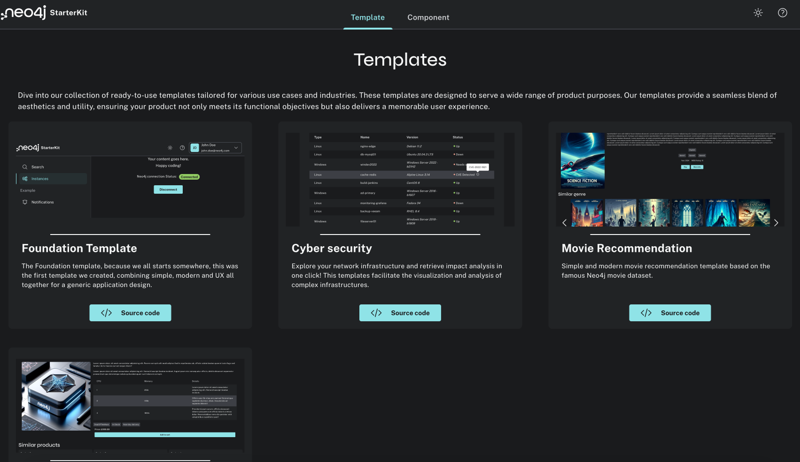
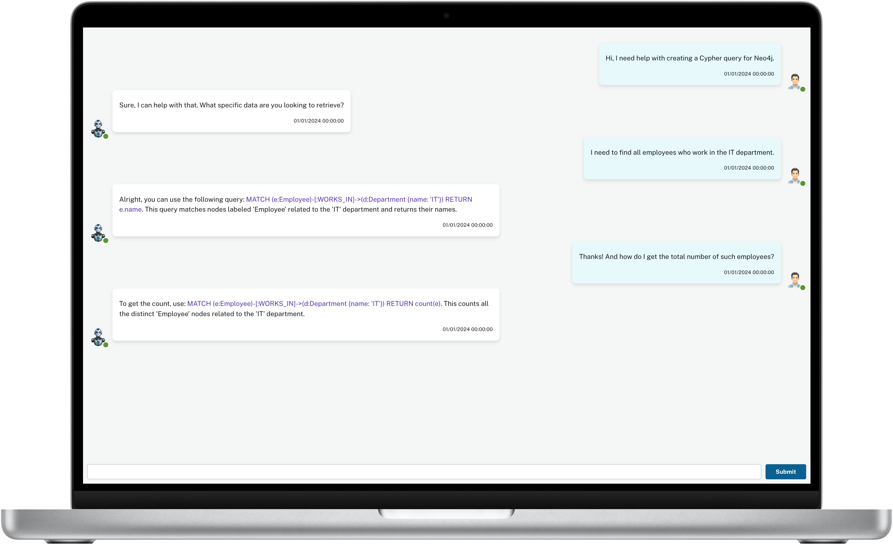

+++
author = "Morgan Senechal"
title = "Needle StarterKit 2.0: Templates, Chatbot, and more!"
date = "2024-03-14"
description = "Need help building your application? Whether a modern frontend, cybersecurity application or a RAG Chatbot , this new version is for you!"
tags = [
    "reactjs",
    "neo4j",
]
categories = [
    "reactjs",
    "neo4j",
]
series = ["Neo4j-Needle-StarterKit"]
aliases = ["Neo4j-Needle-StarterKit"]
image = "assets/FeaturedImg.jpg"
+++
Needle StarterKit 2.0: Templates, Chatbot, and more!
====================================================

I am super excited to announce the release of Needle StarterKit 2.0, a comprehensive library designed to boost the development of your Neo4j front-end applications! This latest version is packed with new features and improvements that promise to accelerate your Time to Value (TTV) while focusing on your needs like never before.

What's New in 2.0?
==================

Needle StarterKit 2.0 introduces a variety of templates and components tailored to specific use cases across different industries, making it more adaptable and efficient for you. 
Key new features include:

4 Templates:

*   [Foundation](https://neo4j.com/labs/neo4j-needle-starterkit/2.0/Templates/Foundation/): The 1st template that was part of the Needle StarterKit. Modern and simple, for all variety of applications.
*   [Cybersecurity](https://neo4j.com/labs/neo4j-needle-starterkit/2.0/Templates/Cybersecurity/): Central search bar to find vulnerabilities or impact analysis in your network in a formatted table or graph.
*   [Movie](https://neo4j.com/labs/neo4j-needle-starterkit/2.0/Templates/Movie/): Based on the famous Neo4j Movie dataset. Ideal template for building an application on top of a recommendation engine.
*   [E-commerce](https://neo4j.com/labs/neo4j-needle-starterkit/2.0/Templates/Ecommerce/): Aim to provide information on a selected product but also provide suggestions on what others have bought or similar products.

3 Components:

*   [Chatbot](https://neo4j.com/labs/neo4j-needle-starterkit/2.0/Components/Chatbot/): A chatbot interface that can easily be plugged into your backend. Ideal for building your next RAG Chatbot on top of a Knowledge Graph!
*   [Connection Modal](https://neo4j.com/labs/neo4j-needle-starterkit/2.0/Components/ConnectionModal/): Connection interface to connect to a Neo4j Database.
*   [Header](https://neo4j.com/labs/neo4j-needle-starterkit/2.0/Components/Header/): A product header / Navbar

Getting Started
===============

To get started with the Needle StarterKit 2.0, ensure you have Node v16 (or higher) installed. The kit is designed to work seamlessly with Neo4j v5.X or higher.

Quick Installation Guide:

```shell
git clone git@github.com:neo4j-labs/neo4j-needle-starterkit.git
cd neo4j-needle-starterkit
yarn install
yarn run dev
```

For a more detailed installation and configuration guide, please refer to the [official documentation](https://neo4j.com/labs/neo4j-needle-starterkit/2.0/).

Explore and Extend
==================

Dive deeper into what the new version has to offer by exploring the provided templates and components. Whether you're working on cybersecurity, e-commerce, or any other domain, the starter kit has something for you!

We also now have a hosted app so that you can see it in action without having to deploy it in your environment, you can access it and try it out at: [https://needle-starterkit.graphapp.io/](https://needle-starterkit.graphapp.io/)



The StarterKit aims to accelerate your time to value when starting to develop an application from scratch, being able to start from a template instead of a blank page and customize it/extend it with your needs.

As part of this version, we also now provide independent components that you can use in your existing applications. For instance, if you think about adding a chatbot to your application, we have a component for that! Simply import the component, plug the message fetcher into your backend, and voila!



We also now provide patterns to help you build an application from a blank page without having to reinvent the wheel with components like the Header, ConnectionModal, and more.
The Needle StarterKit is open source and Apache 2.0, visit the GitHub repository for more information, contribute, and/or access the source code: [https://github.com/neo4j-labs/neo4j-needle-starterkit](https://github.com/neo4j-labs/neo4j-needle-starterkit)

Documentation and Support
=========================

For comprehensive guidance on installing, configuring, and extending the StarterKit, [the documentation](https://neo4j.com/labs/neo4j-needle-starterkit/2.0/) is your go-to resource. Whether you're a beginner or an experienced developer, you'll find valuable insights to make the most out of this version 2.0!

What's next?
============

In the next release, more templates and components will come into the Needle StarterKit but there's more!
How-to/guides/videos will see the light on how to use/integrate the components/templates. For instance with the chatbot interface, an end-to-end guide is currently in progress, so stay tuned if you don't want to miss it!